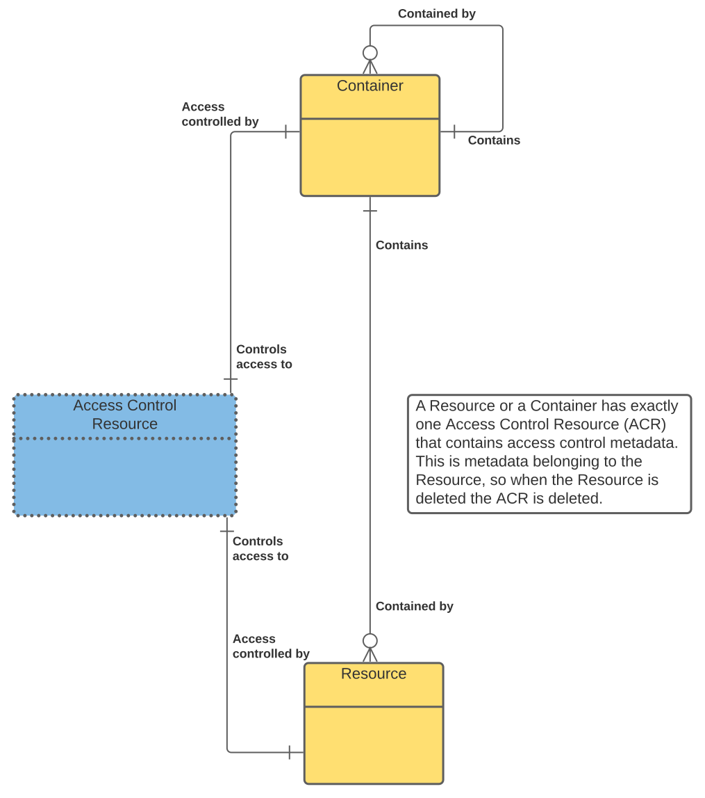
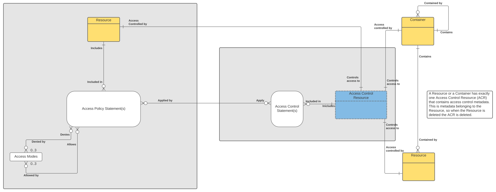
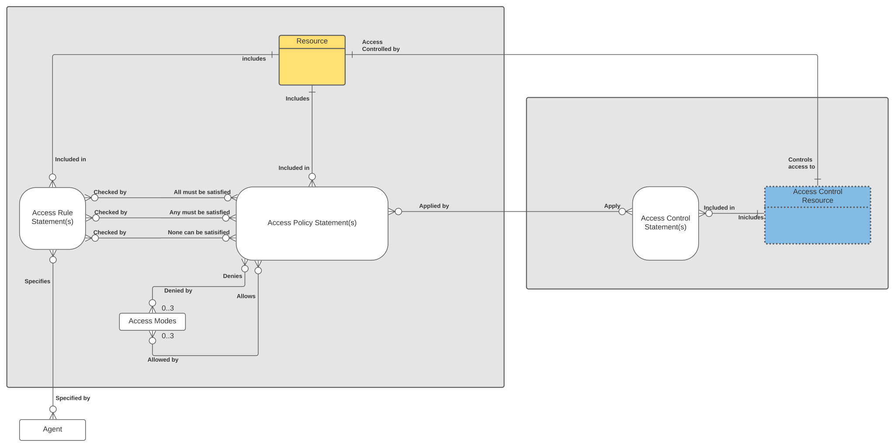
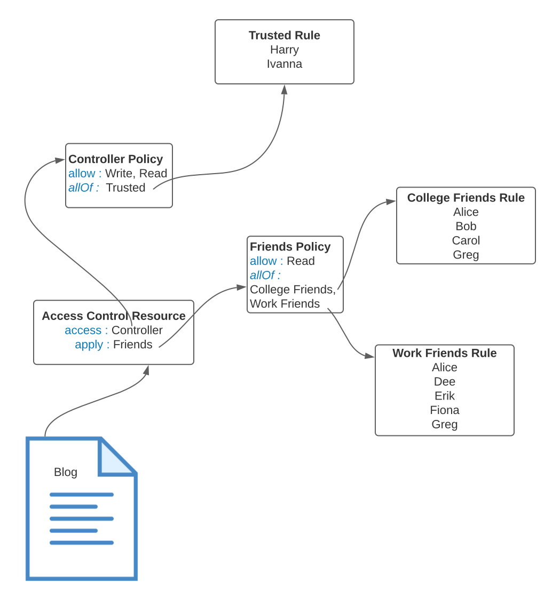

# Introduction

This document describes a proposal for access control policies as an authorization mechanism for Solid servers. The content is based on an implementation of access control policies by Inrupt. The content is not meant to be a protocol specification but rather a description of an implementation that can help inform the authorization panel on how access control policies could work in the Solid ecosystem.

*   [**Section 1**](model.md) describes the data model, the vocabulary and the responsibilities of a Solid server implementing access control policies.
*   [**Section 2**](use-cases.md) provides examples of using access control policies to implement the use cases specified by the Solid authorization panel.
*   [**Section 3**](definitions.md) provides a definition for the terms used throughout the document. 
*   [**Section 4**](enforcement-propagation.md) describes the runtime enforcement of access policies and the server managed propagation and deletion of access policies. 
*   **Section 5** provides the WebIDL for the client API for access control policies. 

## Summary

Access Control Policies are a mechanism to define and enforce authorization to resources stored in a Solid Pod.

### Protecting Resources 

*   Every resource has an associated Access Control Resource (ACR) which is managed by the server; the server is responsible for creating and deleting the ACR. The ACR specifies the access control metadata for the resource.

*   Users can apply policies in an ACR to protect access to the related resource. The policies are included in one or more access control statements.
*   If an ACR does not have a policy, then by default there is no access to the associated resource. However the Pod owner always has access to change the policies on an ACR so resources can never be unreachable by the Pod owner.
*   Each policy specifies whether users are allowed access (Read, Write or Append) to the resource or are denied access to the resource. 

*   Each policy also specifies a list of rules which determine the users the policy applies to. 

*   Note the rules can be specified using the three predicates, allOf, someOf or noneOf. The predicates are evaluated in the order shown and therefore a user specified in one of the rules using noneOf, will not satisfy the policy if the same user was specified in one of the rules using allOf or noneOf.
*   A rule can also specify groups.

*   When applying a policy to a container, a user can specify that the policy should be propagated to all children in that container by using the applyMembers predicate. The server will then ensure that this policy is applied (using the apply predicate) to all resources created in that container.
*   If the resource created in the container is itself a container then the server will also propagate the policy using the applyMembes predicate on the child container. 

In the example below the **_Friends_** policy has been applied to the **_blog_** resource. The **_Friends_** policy states that anybody who satisfies **_allOf_** the **_College Friends_** and **_Work Friends_** rules are **_allow_**ed to have **_Read_** access to the resource protected by the policy i.e. the **_blog _**resource. The only two people who satisfy both rules i.e. appear in both rules, are Alice and Greg. This means that the **_blog_** resource will be available to read by Alice and Greg but nobody else. It also means that neither Alice or Greg will be able to write to the resource. 

### Using Policies 

*   Every resource in a Pod has an associated access control resource. This access control resource (ACR) is created by the server when a resource is created. The ACR contains one or more access control statements. Access control statements specify the policies that have been applied and protect access to  the associated resource.
*   The Pod Owner always has read and write access to all ACRs.
*   This allows the Pod Owner to apply policies to any resource.
*   However, an ACR can also specify policies that determine access to itself.
*   This allows the Pod Owner to grant read and/or write access to other users to an ACR. 
*   In this way, policies can be used to control access to resources, but also to control access to ACRs. So the Pod Owner can delegate control of access for parts of the Pod to other users. 
*   Policies and rules can be defined directly in an ACR, or they can be defined in a separate resource. 

Expanding on the previous example we now wish to add the **_Controller_** policy to the **_blog_** resource. But the **_Controller_** policy does not apply directly to the blog resource, instead it determines **_access_** to the Access Control Resource (ACR) associated with the **_blog_** resource. This determines who can modify the ACR and thereby decide on the access for the **_blog_** resource. 

The **_Controller_** policy gives write and read access to those who satisfy the **_Trusted_** rule. In this case that is simply Harry and Ivanna. So both Harry and Ivanna can change access to the **_blog_** resource by adding and removing policies and rules. 

### Using Rules 

*   A rule simply lists a number of agents and groups. In future rules can be extended to provide more capability. 
*   A policy can specify multiple rules to determine who gets the access defined by the policy. 
*   The rules in the policy can be combined so that 
    *   All of the rules need to be satisfied (the user needs to be in all the rules)
    *   Any of the rules need to be satisfied (the user needs to be in at least one rule)
    *   None of the rules can be satisfied (the user cannot be in any of the rules)
*   Using rules the user has fine grained control over who gets the access specified by a policy.

### Advanced policy management 

*   A user needs write access to an ACR in order to add and remove policies to that ACR.
*   When a policy is added to an ACR for a container it is possible to add it so that it applies to the container (apply predicate)  or that it applies to all children of the container (applyMembers predicate). 
*   The server will manage the propagation of the policies to children as they are created.
*   The server will also manage the removal of policies from children if a policy applied with the applyMembers predicate is removed from a parent container.
*   Policies can be applied in three ways:
    *  **Normal (using apply predicate)**

      When a policy is applied to an ACR it can also be removed from the ACR by anybody with write access to the ACR. This also applies when the policy is propagated to a container's children. So if a policy is applied to container /A and later propagated to the child resource /A/B, anybody with write access to the ACR for the resource /A/B can remove that policy from /A/B. This applies to /A/B/C and to any depth in the resource tree.

    *   **Protected (using applyProtected predicate)**

       When a protected policy is applied to an ACR it can also be removed from the ACR by anybody with write access to the ACR. However, when the policy is propagated to a container’s children (using applyMembersProtected predicate), then removing the policy from a child resource requires write access to the ACR for the resource where the policy was originally applied. So if a policy is applied to container /A and later propagated to the child resource /A/B, only people with write access to the ACR for the resource /A can remove that policy from /A/B. Similarly only people with write access to the ACR for the resource /A can remove that policy from /A/B/C. This applies to any depth in the resource tree. 

    *   **Locked (using applyLocked predicate)**

       When a locked policy is applied to an ACR it can only be removed from the ACR by anybody with write access to the root ACR, i.e. the ACR for ‘/’. If a locked policy is applied to the resource /A/B then people who have access to the ACR for /A/B cannot remove that policy. Similarly people who have access to the ACR for /A cannot remove that policy. Only people with access to the ACR for / can remove that policy. The same applies if the locked policy is propagated to children of /A/B.
