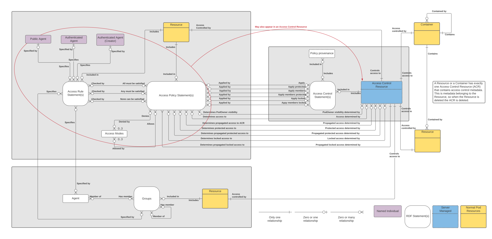

# 1. Model

The summary provided an overview of the model and a few examples. The next section provides examples using the use cases documented by the Solid Authorization Panel. Before getting to the use cases, this section provides a figure showing all of the details in the model, a link to the vocabulary and describes the responsibilities of a server that implements Access Control Policies.

## Model

The [model](diagrams/acp.svg) provides a visual representation of the access control policy [definitions](definitions.md).



## Vocabulary

The Access Control Policy [vocabulary](https://github.com/inrupt/access-control-policy-vocabulary/blob/master/acp.ttl). 

## Server Responsibilities

In the text below acp is defined as:

```rdf
prefix acp: <http://w3.org/ns/solid/acp#>
```

1. When a resource is created, the server MUST store the [WebID](definitions.md#webid) of the [Agent](definitions.md#agent) who created the resource and the timestamp when the resource was created.
2. When a resource is modified, the server MUST store the [WebID](definitions.md#webid) of the [Agent](definitions.md#agent) who modified the resource and the timestamp when the resource was modified.
3. Every resource MUST have an associated [Access Control Resource](definitions.md#access-control-resource).
4. When a resource is created in a container C, the server MUST create an [ACR](definitions.md#access-control-resource) for the resource and populate the [ACR](definitions.md#access-control-resource) with the appropriate [Access Policy](definitions.md#access-policy) statements as described by the following predicates in the [ACR](definitions.md#access-control-resource) for C.

    1. _acp:accessMembers_
    2. _acp:accessMembersProtected_ 
    3. _acp:accessMembersLocked_ 
    4. _acp:applyMembers_ 
    5. _acp:applyMembersProtected_  
    6. _acp:applyMembersLocked_ 


5. When an [Access Policy](definitions.md#access-policy) is added to an [Access Control](definitions.md#access-control) in an [ACR](definitions.md#access-control-resource) for a container, with any of the predicates, _applyMembers_, applyMembersProtected or _applyMembersLocked_, the server is responsible for propagating that [Access Policy](definitions.md#access-policy) to all the children of the container.
6. When an [Access Policy](definitions.md#access-policy) with any of the predicates, _applyMembers_, applyMembersProtected or _applyMembersLocked_, is removed from an [Access Control](definitions.md#access-control) in an [ACR](definitions.md#access-control-resource) for a container, the server is responsible for removing that [Access Policy](definitions.md#access-policy) from all the children of the container.
7. An [Access Policy](definitions.md#access-policy) applied with the _applyMembersLocked_ or _applyLocked_ predicate can only be removed by an [Agent](definitions.md#agent) who has acp:Write access to the ACR for the root of the Pod.
8. An [Access Policy](definitions.md#access-policy) applied with the _applyMembersProtected_ or _applyProtected_ predicate can only be removed by an [Agent](definitions.md#agent) who has acp:Write access to the ACR for the Container where the [Access Policy](definitions.md#access-policy) was first applied. 
9. When an [Access Policy](definitions.md#access-policy) is propagated via the _applyMembersProtected_ predicate, the server is responsible for storing a reference to the ACR where the [Access Policy](definitions.md#access-policy) was originally propagated from. This reference is used by the server to determine whether an [Agent](definitions.md#agent) has the relevant access to remove the [Access Policy](definitions.md#access-policy). Note if the ability to move resources was ever implemented then the _applyMembersProtected_ predicate would need to be re-examined.
10. An [Agent](definitions.md#agent) must have acp:Write access to the ACR as determined by the _acp:access_ predicate in order to add or remove an [Access Policy](definitions.md#access-policy) to the ACR using _acp:apply_ or _acp:applyMembers_.
11. An [Agent](definitions.md#agent) must have acp:Write access to the ACR as determined by the _acp:accessProtected_ predicate in order to add or remove an [Access Policy](definitions.md#access-policy) to the ACR using _acp:applyProtected_ or _acp:applyMembersProtected_.
12. An [Agent](definitions.md#agent) must have acp:Write access to the ACR as determined by the _acp:accessLocked_ predicate in order to add or remove an [Access Policy](definitions.md#access-policy) to the ACR using _acp:applyLocked_ or _acp:applyMembersLocked_.
13. A server MUST NOT support the use of more than one access control mechanism (e.g. ACP and WAC) on the same Pod unless the two mechanisms provide compatibility guarantees. 
14. Access to view or modify an ACR is controlled by the _acp:access_ predicate, the object of which is an [Access Policy](definitions.md#access-policy). 
15. When a resource R is created in a container C, the object of the _acp:accessMembers_ predicate in C, is propagated to the _acp:access_ predicate in R. If R is also a container then the value of _acp:accessMembers_ in C is also propagated to _acp:accessMembers_ in R.
16. When a resource R is created in a container C, the object of the _acp:accessMembersProtected_ predicate in C, is propagated to the _acp:accessProtected_ predicate in R. If R is also a container then the value of _acp:accessMembersProtected_ in C is also propagated to _acp:accessMembersProtected_ in R.
17. When a resource R is created in a container C, the object of the _acp:accessMembersLocked_ predicate in C, is propagated to the _acp:accessLocked_ predicate in R. If R is also a container then the value of _acp:accessMembersLocked_ in C is also propagated to _acp:accessMembersLocked_ in R.
