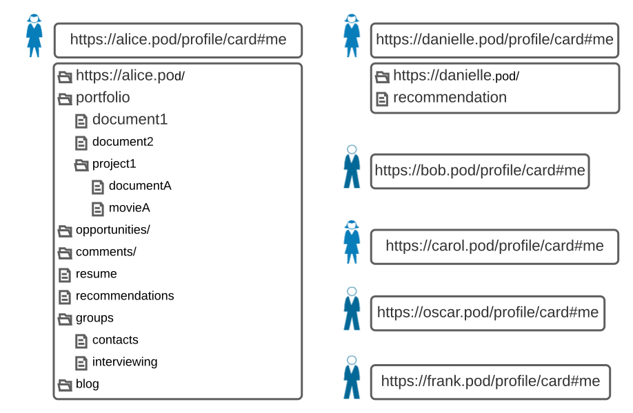
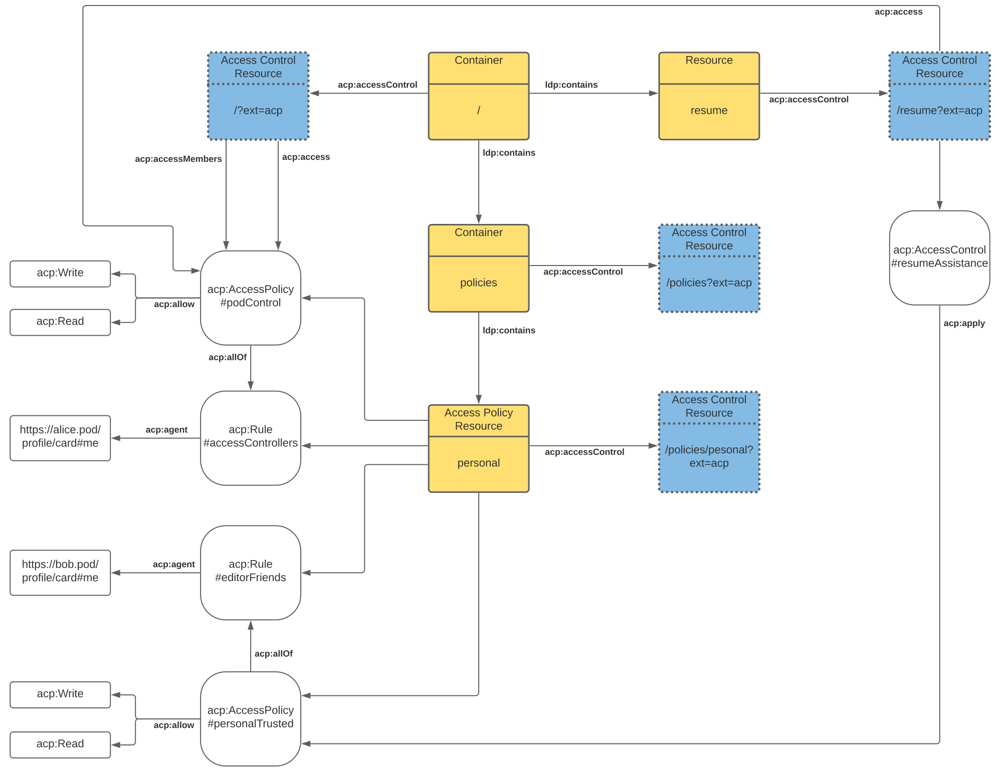
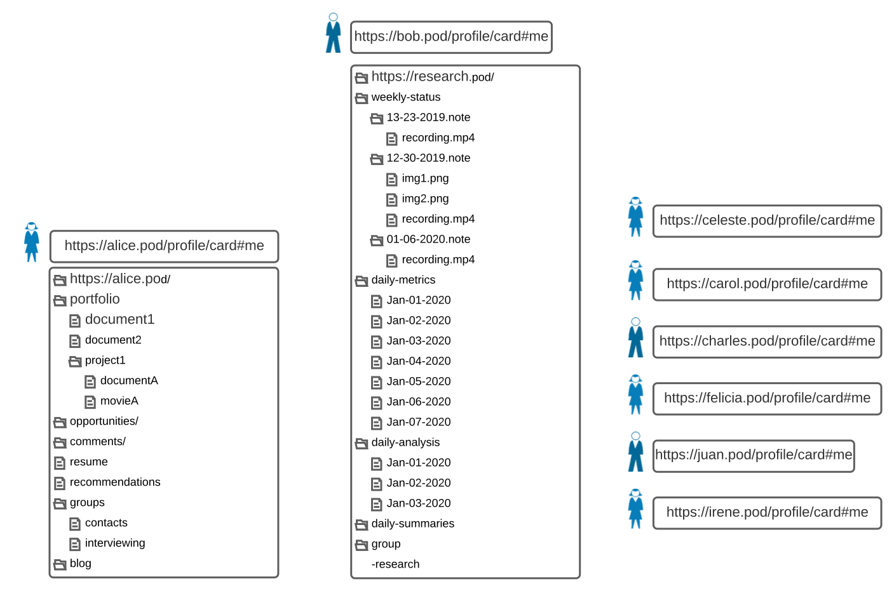

# 2. Use Cases

The use cases are defined in [Use Cases and Requirements for Web Access Control](https://solid.github.io/authorization-panel/wac-ucr/). 

For each use case the following will be provided:

*   A diagram of the [Agents](definitions.md#agent), Pods and resources.
*   A link to the specific use case.
*   The appropriate access control statements in [Turtle](https://www.w3.org/TR/turtle/).
*   An examination of the use case.

## 2.1 Basic Resource Access



### [2.1.1 Control Access](https://solid.github.io/authorization-panel/wac-ucr/#basic-control)

_Alice asks Bob to help make her resume more presentable. Alice must give Bob permission to do this, because her resume is not a public resource, and as the[ resource controller](https://solid.github.io/authorization-panel/wac-ucr/#resource-controller) Alice is the only one who can manage permissions for it._

By default the WebID used to provision a Pod becomes the [Pod Owner](definitions.md#pod-owner). The Pod Owner always has _acp:Read_ and _acp:Write_ access to all [Access Control Resources](definitions.md#access-control-resource) and therefore has complete control over the entire Pod.

When a Pod is first provisioned, only the Pod Owner has access and they must then actively decide to give any other WebID access to resources.

If a Pod has no policies defined, the Pod Owner can create policies and rules in the ACR for the root / container and use those policies to apply access control to the root container. 

Create a ‘policies’ container

```HTTP
POST / HTTP/1.1
Host: alice.pod
Content-Type: text/turtle
Link: <http://www.w3.org/ns/ldp#BasicContainer>; rel="type"
Slug: policies
```
```HTTP
HTTP/1.1 201 Created
Location: /policies
```

Create the personal [Access Policy Resource](definitions.md#access-policy-resource). We should use the Location HTTP header in the response from the previous POST because the Slug header may be ignored by the server. 

```HTTP
PUT /policies/personal HTTP/1.1
HOST: alice.pod
Content-Type: text/turtle
```
```Turtle
@prefix acp: <http://www.w3.org/ns/solid/acp#> .
@prefix rdf: <http://www.w3.org/1999/02/22-rdf-syntax-ns#> .

<> a acp:AccessPolicyResource .
 
# Policies

<#personalTrusted>
  a acp:AccessPolicy ;
  acp:allow acp:Write, acp:Read ;
  acp:allOf <#editorFriends> .

<#podControl>
  a acp:AccessPolicy ;
  acp:allow acp:Write, acp:Read ;
  acp:allOf <#accessControllers> .

# Rules

<#editorFriends>
  a acp:Rule ;
  acp:agent <https://bob.pod/profile/card#me> .

<#accessControllers>
  a acp:Rule ;
  acp:agent <https://alice.pod/profile/card#me> .
```
```HTTP
HTTP/1.1 201 Created
Location: /policies/personal
```

Apply the podControl [Access Policy](definitions.md#access-policy) to the root of the Pod and all its current and future children.

```HTTP
PATCH /?ext=acp HTTP/1.1
Host: alice.pod
Content-Type: application/sparql-update
```
```SPARQL
prefix acp: <http://www.w3.org/ns/solid/acp#>
prefix : <https://alice.pod/policies/personal#>

INSERT DATA { 
<>
  acp:access :podControl ;
  acp:accessMembers :podControl .

<#myPodAccess>
  a acp:AccessControl ;
  acp:applyConstant :podControl ;
  acp:applyMembersConstant :podControl .
}
```
```HTTP
HTTP/1.1 204 No Content
```


### [2.1.2 Read Write Access](https://solid.github.io/authorization-panel/wac-ucr/#basic-write)

_Alice gives Bob [read access](https://solid.github.io/authorization-panel/wac-ucr/#read-access) so that he can read the resume resource, and [write access](https://solid.github.io/authorization-panel/wac-ucr/#write-access) so that he can make changes to it, which he does._

Create Resume

```HTTP
PUT /resume HTTP/1.1
HOST: alice.pod
Content-Type: text/plain

This is my resume and I am not sure where to start.
I hope that Bob can help me because he is great at this type of thing and I trust him completely. 
```
```HTTP
HTTP/1.1 201 Created
```

Let’s see what the IRI for the [Access Control Resource](definitions.md#access-control-resource) for /resume is.

```HTTP
HEAD /resume HTTP/1.1
HOST: alice.pod
```
```HTTP
HTTP/1.1 200 OK
Link: <https://alice.pod/resume?ext=acp>; rel="http://www.w3.org/ns/solid/acp#accessControl"
```

Now Alice gives Bob access to edit her resume. 

```HTTP
PATCH /resume?ext=acp HTTP/1.1
Host: alice.pod
Content-Type: application/sparql-update
```
```SPARQL
prefix acp: <http://www.w3.org/ns/solid/acp#>
prefix : <https://alice.pod/policies/personal#>

INSERT DATA { 
<#resumeAssistance>
  a acp:AccessControl ;
  acp:apply :personalTrusted .
}
```
```HTTP
HTTP/1.1 204 No Content
```



### [2.1.3.1. Alice stores Danielle’s recommendation](https://solid.github.io/authorization-panel/wac-ucr/#basic-readappend-single-storage)

_Danielle agrees to give Alice a personal reference, which Alice will include in the references section of her resume. Alice gives Danielle read access to resume for context, and append access so that she can only add new data to resume, and cannot change any existing data within it. Danielle adds a glowing reference for Alice to resume._

Provide Danielle with access to the resume.

```HTTP
PATCH /policies/personal HTTP/1.1
Host: alice.pod
Content-Type: application/sparql-update
```
```SPARQL
prefix acp: <http://www.w3.org/ns/solid/acp#>
prefix : <https://alice.pod/policies/personal#>

INSERT DATA { 

<#commentsOnly>
  a acp:AccessPolicy ;
  acp:allow acp:Append, acp:Read ;
  acp:allOf <#commenters> .

<#commenters>
  a acp:Rule ;
  acp:agent <https://danielle.pod/profile/card#me> .

}
```
```HTTP
HTTP/1.1 204 No Content
```

```HTTP
PATCH /resume?ext=acp HTTP/1.1
Host: alice.pod
Content-Type: application/sparql-update
```
```SPARQL
prefix acp: <http://www.w3.org/ns/solid/acp#>
prefix : <https://alice.pod/policies/personal#>

INSERT DATA { 
<#resumeAssistance>
  a acp:AccessControl ;
  acp:apply :commentsOnly .
}
```
```HTTP
HTTP/1.1 204 No Content
```

Danielle adds a glowing reference to Alice’s resume. **The use of application/merge-patch here is merely an example. The media-type used will depend on the type of data and the semantics will then depend on the implementation and/or the standards around the media-type. The purpose of the example below is to show that ACP can handle providing acp:Append only access.**

```HTTP
PATCH /resume HTTP/1.1
Host: alice.pod
Content-Type: application/merge-patch; type="text/plain"

Alice is such a wonderful person to work with. 
She brings passion and expertise that any team would be lucky to have. 
I highly recommend Alice as part of your team if you have the opportunity 
and I would happily work with Alice again in the future. 
```
```HTTP
HTTP/1.1 204 No Content
```


### [2.1.3.2. Danielle stores their own recommendation](https://solid.github.io/authorization-panel/wac-ucr/#basic-readappend-multi-storage)

_Danielle agrees to give Alice a personal reference, which Alice will link to in the reference section of her resume. Alice gives Danielle read access to resume for context, and append access so that she can add a link to the recommendation that she creates and hosts on her own resource server at https://danielle.example/recommendation. Danielle is the resource controller for that resource and gives it public read access._

Create the public policy to allow sharing of a recommendation

```HTTP
PUT /mypolicies HTTP/1.1
HOST: danielle.pod
Content-Type: text/turtle
```
```Turtle
@prefix acp: <http://www.w3.org/ns/solid/acp#> .
@prefix rdf: <http://www.w3.org/1999/02/22-rdf-syntax-ns#> .

<> a acp:AccessPolicyResource .
 
# Policies

<#publicAccess>
  a acp:AccessPolicy ;
  acp:allow acp:Read ;
  acp:allOf <#public> .

# Rules

<#public>
  a acp:Rule ;
  acp:agent acp:PublicAgent .
```
```HTTP
HTTP/1.1 201 Created
Location: /mypolicies
```

Write the recommendation

```HTTP
PUT /recommendation HTTP/1.1
HOST: danielle.pod
Content-Type: text/plain

Alice is such a wonderful person to work with. 
She brings passion and expertise that any team would be lucky to have. 
I highly recommend Alice as part of your team if you have the opportunity 
and I would happily work with Alice again in the future. 
```
```HTTP
HTTP/1.1 201 Created
```

Let’s see what the IRI for the [Access Control Resource](definitions.md#access-control-resource) for /recommendation is.

```HTTP
HEAD /recommendation HTTP/1.1
HOST: danielle.pod
```
```HTTP
HTTP/1.1 200 OK
Link: <https://danielle.pod/recommendation?ext=acp>; rel="http://www.w3.org/ns/solid/acp#accessControl"
```

Give public access to the recommendation.

```HTTP
PATCH /recommendation?ext=acp HTTP/1.1
Host: danielle.pod
Content-Type: application/sparql-update
```
```SPARQL
prefix acp: <http://www.w3.org/ns/solid/acp#>
prefix : <https://danielle.pod/mypolicies#>

INSERT DATA { 
<#open>
  a acp:AccessControl ;
  acp:apply :publicAccess .
}
```
```HTTP
HTTP/1.1 204 No Content
```


### [2.1.4. Append-only access](https://solid.github.io/authorization-panel/wac-ucr/#basic-appendonly)

_Alice is interested in seeing whether any of her other contacts might provide good recommendations that she can include as additional references or a resume cover letter._

_She creates a recommendations resource, and grants [append access](https://solid.github.io/authorization-panel/wac-ucr/#append-access) to the contacts [authorization group](https://solid.github.io/authorization-panel/wac-ucr/#authorization-group), which represents every professional contact in her virtual rolodex. She sends a mass-mail to contacts, with a link to an app they can use to submit a recommendation, which will be appended to recommendations. Since they only have [append access](https://solid.github.io/authorization-panel/wac-ucr/#append-access) and not [read access](https://solid.github.io/authorization-panel/wac-ucr/#read-access), they can add to recommendations but they cannot see recommendations that have already been added._

Create a group called contacts.

```HTTP
PUT /contacts HTTP/1.1
HOST: alice.pod
Content-Type: text/turtle
```
```Turtle
@prefix vcard: <http://www.w3.org/2006/vcard/ns#> .
 
<> a vcard:Group;
	vcard:hasMember <https://bob.pod/profile/card#me> ;
	vcard:hasMember <https://danielle.pod/profile/card#me> ;
	vcard:hasMember <https://frank.pod/profile/card#me> ;
	vcard:hasMember <https://jane.pod/profile/card#me> .
```
```HTTP
HTTP/1.1 201 Created
```

Make the group private

```HTTP
PATCH /contacts?ext=acp HTTP/1.1
Host: alice.pod
Content-Type: application/sparql-update
```
```SPARQL
prefix acp: <http://www.w3.org/ns/solid/acp#>
prefix : <https://alice.pod/personal#>

INSERT DATA { 
<#private>
  a acp:AccessControl ;
  acp:apply :podControl .
}
```
```HTTP
HTTP/1.1 204 No Content
```

Create the recommendations resource

```HTTP
PUT /recommendations HTTP/1.1
HOST: alice.pod
Content-Type: text/plain
```
```HTTP
HTTP/1.1 201 Created
```

Create the policy to allow append access to the contacts group

```HTTP
PATCH /policies/personal HTTP/1.1
Host: alice.pod
Content-Type: application/sparql-update
```
```SPARQL
prefix acp: <http://www.w3.org/ns/solid/acp#>
prefix : <https://alice.pod/policies/personal#>

INSERT DATA { 

<#recommend>
  a acp:AccessPolicy ;
  acp:allow acp:Append ;
  acp:allOf <#canRecommend> .

<#canRecommend>
  a acp:Rule ;
  acp:group <https://alice.pod/contacts> .

}
```
```HTTP
HTTP/1.1 204 No Content
```

Apply the ‘recommend’ policy to the recommendations resource.

```HTTP
PATCH /recommendations?ext=acp HTTP/1.1
Host: alice.pod
Content-Type: application/sparql-update
```
```SPARQL
prefix acp: <http://www.w3.org/ns/solid/acp#>
prefix : <https://alice.pod/policies/personal#>

INSERT DATA { 
<#access>
  a acp:AccessControl ;
  acp:apply :recommend .
}
```
```HTTP
HTTP/1.1 204 No Content
```


### [2.1.5. Removing access](https://solid.github.io/authorization-panel/wac-ucr/#basic-removing)

_Alice removes Bob and Danielle’s access to resume, since they’ve both finished contributing to it. They can no longer read or make changes to it._

Remove the two policies from the ACR for the resume. We could also remove the policies and rules from the Pod but there is no need and we can reuse them later with the same or different resources. 

```HTTP
PATCH /resume?ext=acp HTTP/1.1
Host: alice.pod
Content-Type: application/sparql-update
```
```SPARQL
prefix acp: <http://www.w3.org/ns/solid/acp#>
prefix : <https://alice.pod/policies/personal#>

DELETE DATA { 
<#access>
  acp:apply :personalTrusted ;
  acp:apply :commentsOnly .
}
```
```HTTP
HTTP/1.1 204 No Content
```

### [2.1.6. Read-only access](https://solid.github.io/authorization-panel/wac-ucr/#basic-readonly)

_Alice has a job interview with Carol. Alice gives Carol[ read access](https://solid.github.io/authorization-panel/wac-ucr/#read-access) to resume ahead of the interview._

Create the policy to allow read access.

```HTTP
PATCH /policies/personal HTTP/1.1
Host: alice.pod
Content-Type: application/sparql-update
```
```SPARQL
prefix acp: <http://www.w3.org/ns/solid/acp#>
prefix : <https://alice.pod/policies/personal#>

INSERT DATA { 

<#namedRead>
  a acp:AccessPolicy ;
  acp:allow acp:Read ;
  acp:allOf <#readers> .

<#readers>
  a acp:Rule ;
  acp:agent <https://carol.pod/profile/card#me> .
}
```
```HTTP
HTTP/1.1 204 No Content
```

Apply the ‘namedRead’ policy to the resume resource.

```HTTP
PATCH /resume?ext=acp HTTP/1.1
Host: alice.pod
Content-Type: application/sparql-update
```
```SPARQL
prefix acp: <http://www.w3.org/ns/solid/acp#>
prefix : <https://alice.pod/policies/personal#>

INSERT DATA { 
<#access>
  acp:apply :namedRead .
}
```
```HTTP
HTTP/1.1 204 No Content
```

### [2.1.7. Group access](https://solid.github.io/authorization-panel/wac-ucr/#basic-group)

_Alice has additional interest, and is now interviewing with people from multiple organizations, including Carol, Oscar, and Frank._

_To make it easier to keep track of everyone, Alice creates an interviewing [authorization group](https://solid.github.io/authorization-panel/wac-ucr/#authorization-group) and adds Carol, Oscar, and Frank to it. She grants [read access](https://solid.github.io/authorization-panel/wac-ucr/#read-access) on resume to the interviewing [authorization group](https://solid.github.io/authorization-panel/wac-ucr/#authorization-group)._

_Alice removes any individual permissions on her resume that were granted to members of the interviewing [authorization group](https://solid.github.io/authorization-panel/wac-ucr/#authorization-group) since they are no longer necessary._

_Now Alice can add new people she’s interviewing with to the interviewing [authorization group](https://solid.github.io/authorization-panel/wac-ucr/#authorization-group), and remove them when the opportunity is no longer active. This is much more intuitive and easy for Alice._

Create a group called interviewing

```HTTP
PUT /interviewing HTTP/1.1
HOST: alice.pod
Content-Type: text/turtle
```
```Turtle
prefix vcard: <http://www.w3.org/2006/vcard/ns#>
 
<> a vcard:Group ;
  vcard:hasMember <https://carol.pod/profile/card#me> ;
  vcard:hasMember <https://oscar.pod/profile/card#me> ;
  vcard:hasMember <https://frank.pod/profile/card#me> .
```
```HTTP
HTTP/1.1 201 Created
```

Make the group private

```HTTP
PATCH /interviewing?ext=acp HTTP/1.1
Host: alice.pod
Content-Type: application/sparql-update
```
```SPARQL
prefix acp: <http://www.w3.org/ns/solid/acp#>
prefix : <https://alice.pod/personal#>

INSERT DATA { 
<#private>
  a acp:AccessControl ;
  acp:apply :podControl .
}
```
```HTTP
HTTP/1.1 204 No Content
```

Give read access to the interviewing group and remove individual access for carol as she is a member of the interviewing group.

```HTTP
PATCH /policies/personal HTTP/1.1
Host: alice.pod
Content-Type: application/sparql-update
```
```SPARQL
prefix acp: <http://www.w3.org/ns/solid/acp#>
prefix : <https://alice.pod/policies/personal#>

INSERT DATA { 
<#readers> acp:group </interviewing> .
}
DELETE DATA {
<#readers> acp:agent <https://carol.pod/profile/card#me> .
}
```
```HTTP
HTTP/1.1 204 No Content
```

### [2.1.8. Public access](https://solid.github.io/authorization-panel/wac-ucr/#basic-public) 

_Alice decides her resume is ready to share with everyone, so she gives [read access](https://solid.github.io/authorization-panel/wac-ucr/#read-access) to the public (everyone), and shares a link to it on several job boards._

Give read access to the public by amending the ‘readers’ rule and remove group access for the interviewing group as there is no need now that the resource is public. We could also delete the interviewing group if it was no longer going to be used. 

```HTTP
PATCH /policies/personal HTTP/1.1
Host: alice.pod
Content-Type: application/sparql-update
```
```SPARQL
prefix acp: <http://www.w3.org/ns/solid/acp#>
prefix : <https://alice.pod/policies/personal#>

INSERT DATA { 
<#readers> acp:agent acp:PublicAgent .
}
DELETE DATA {
<#readers> acp:group </interviewing> .
}
```
```HTTP
HTTP/1.1 204 No Content
```

### [2.1.9. Logged in access](https://solid.github.io/authorization-panel/wac-ucr/#basic-authenticated)

_Alice runs an open online workshop for a few people she works with but also she sends an invitation to a public mailing list suggesting experts in her field should also come._

_She sets the access to the materials so that anyone who has a solid ID can log in and access it. (They have read access to the agenda, and write access to the minutes, say)._

_She uses an app which accumulates the set of Ids of the people who have used this access as a group._

_People who follow her link to the materials are prompted by the system to log in, or if necessary to make a new solid account and then log in._

_After the workshop is over, she changes the access on the materials to explicitly be that group._

Create a container for the workshop

```HTTP
PUT /workshops HTTP/1.1
Host: alice.pod
Content-Type: text/turtle
Link: <http://www.w3.org/ns/ldp#BasicContainer>; rel="type"

```
```HTTP
HTTP/1.1 201 Created
Location: /workshops
```

```HTTP
PUT /workshops/workshop1 HTTP/1.1
Host: alice.pod
Content-Type: text/turtle
Link: <http://www.w3.org/ns/ldp#BasicContainer>; rel="type"

```
```HTTP
HTTP/1.1 201 Created
Location: /workshops/workshop1
```

Create the agenda and the minutes resources.

```HTTP
PUT /workshops/workshop1 agenda HTTP/1.1
HOST: alice.pod
Content-Type: text/plain

Agenda:

1 - Introductions
2 - The topic of the day
3 - Decisions
4 - Wrap up
```
```HTTP
HTTP/1.1 201 Created
```

```HTTP
PUT /workshops/workshop1/minutes HTTP/1.1
HOST: alice.pod
Content-Type: text/plain

Minutes:

```
```HTTP
HTTP/1.1 201 Created
```

Set Write access to the minutes and Read access to the agenda for anybody who is authenticated in the Solid ecosystem. We could put the policies in the /policies/personal resource that we already created but for this example we will create another resource specifically for workshop policies just to show that policies can be created anywhere. 

```HTTP
PUT /workshops/policies HTTP/1.1
HOST: alice.pod
Content-Type: text/turtle
```
```Turtle
@prefix acp: <http://www.w3.org/ns/solid/acp#> .
@prefix rdf: <http://www.w3.org/1999/02/22-rdf-syntax-ns#> .

<> a acp:AccessPolicyResource .
 
# Policies

<#openMaterial>
  a acp:AccessPolicy ;
  acp:allow acp:Read ;
  acp:allOf <#openWorkshop> .

<#openInteraction>
  a acp:AccessPolicy ;
  acp:allow acp:Write, acp:Read ;
  acp:allOf <#openWorkshop> .

# Rules

<#openWorkshop>
  a acp:Rule ;
  acp:agent acp:AuthenticatedAgent .
```
```HTTP
HTTP/1.1 201 Created
Location: /workshops/policies
```

```HTTP
PATCH /workshops?ext=acp HTTP/1.1
Host: alice.pod
Content-Type: application/sparql-update
```
```SPARQL
prefix acp: <http://www.w3.org/ns/solid/acp#>
prefix : <https://alice.pod/workshops/policies#>

INSERT DATA { 
<#access>
  a acp:AccessControl ;
  acp:apply :openMaterial ;
  acp:applyMembers :openMaterial .
}
```
```HTTP
HTTP/1.1 204 No Content
```

```HTTP
PATCH /workshops/workshop1/minutes?ext=acp HTTP/1.1
Host: alice.pod
Content-Type: application/sparql-update
```
```SPARQL
prefix acp: <http://www.w3.org/ns/solid/acp#>
prefix : <https://alice.pod/workshops/policies#>

INSERT DATA { 
<#access>
  a acp:AccessControl ;
  acp:apply :openInteraction .
}
```
```HTTP
HTTP/1.1 204 No Content
```

Create the group for everybody who attended the workshop.

```HTTP
PUT /workshops/workshop1/attendees HTTP/1.1
HOST: alice.pod
Content-Type: text/turtle
```
```Turtle
@prefix vcard: <http://www.w3.org/2006/vcard/ns#> .
 
<> a vcard:Group ;
	vcard:hasMember <https://bob.pod/profile/card#me> ;
	vcard:hasMember <https://danielle.pod/profile/card#me> ;
	vcard:hasMember <https://frank.pod/profile/card#me> ;
	vcard:hasMember <https://jane.pod/profile/card#me> .
```
```HTTP
HTTP/1.1 201 Created
```

Make the group private

```HTTP
PATCH /workshops/workshop1/attendees?ext=acp HTTP/1.1
Host: alice.pod
Content-Type: application/sparql-update
```
```SPARQL
prefix acp: <http://www.w3.org/ns/solid/acp#>
prefix : <https://alice.pod/personal#>

INSERT DATA { 
<#private>
  a acp:AccessControl ;
  acp:apply :podControl .
}
```
```HTTP
HTTP/1.1 204 No Content
```

The workshop is now over so the access will be changed to read only for the materials and the minutes and it will be made available only to those who attended the workshop.

Create the policy that applies only to the attendees group.

```HTTP
PUT /workshops/workshop1/policy HTTP/1.1
HOST: alice.pod
Content-Type: text/turtle
```
```Turtle
prefix acp: <http://www.w3.org/ns/solid/acp#>
prefix rdf: <http://www.w3.org/1999/02/22-rdf-syntax-ns#>

<> a acp:AccessPolicyResource .
 
# Policies

<#attendeesAccess>
  a acp:AccessPolicy ;
  acp:allow acp:Read ;
  acp:allOf <#attendees> .

# Rules

<#attendees>
  a acp:Rule ;
  acp:group </workshops/workshop1/attendees> .
```
```HTTP
HTTP/1.1 201 Created
Location: /workshops/workshop1/policy
```

Apply the new policy to all the material for the workshop.

```HTTP
PATCH /workshops/workshop1/?ext=acp HTTP/1.1
Host: alice.pod
Content-Type: application/sparql-update
```
```SPARQL
prefix acp: <http://www.w3.org/ns/solid/acp#>
prefix : <https://alice.pod/workshops/workshop1/policy#>

INSERT DATA { 
<#access>
  a acp:AccessControl ;
  acp:apply :attendeesAccess ;
  acp:applyMembers :attendeesAccess .
}
```
```HTTP
HTTP/1.1 204 No Content
```

```HTTP
PATCH /workshops/workshop1/minutes?ext=acp HTTP/1.1
Host: alice.pod
Content-Type: application/sparql-update
```
```SPARQL
prefix acp: <http://www.w3.org/ns/solid/acp#>
prefix : <https://alice.pod/workshops/policies#>

DELETE DATA { 
<#access>
  acp:apply :openInteraction .
}
```
```HTTP
HTTP/1.1 204 No Content
```

## 2.2 Basic Collection Access


### 2.2.1 Read-only access to a Collection

_Alice has identified several companies that she’d like to work for, as well as the specific people (Carol, Oscar, and Frank) to contact at each one._

_Alice sends individual emails to Carol, Oscar, and Frank with links to her resume and portfolio._

_Alice has granted Carol, Oscar, and Frank [read access](https://solid.github.io/authorization-panel/wac-ucr/#read-access) to her resume which allows them to read its contents fully._

_Alice has also granted them [read access](https://solid.github.io/authorization-panel/wac-ucr/#read-access) to the portfolio [collection](https://solid.github.io/authorization-panel/wac-ucr/#collection). She only wants them to see detail about the portfolio [collection](https://solid.github.io/authorization-panel/wac-ucr/#collection) itself, along with a listing of its contents, but not the contents of the [resources](https://solid.github.io/authorization-panel/wac-ucr/#resource) included in that [collection](https://solid.github.io/authorization-panel/wac-ucr/#collection) just yet._

_Alice wants to know which of them are really interested based on who asks her for more access to the contents of her portfolio._

Examples giving read access to the resume were provided in previous use cases so will not be repeated here.

Create the policy to allow read access.

```HTTP
PATCH /policies/personal HTTP/1.1
Host: alice.pod
Content-Type: application/sparql-update
```
```SPARQL
prefix acp: <http://www.w3.org/ns/solid/acp#>
prefix : <https://alice.pod/policies/personal#>

INSERT DATA { 

<#jobRead>
  a acp:AccessPolicy ;
  acp:allow acp:Read ;
  acp:allOf <#jobContacts> .

<#jobContacts>
  a acp:Rule;
  acp:agent <https://carol.pod/profile/card#me> ;
  acp:agent <https://oscar.pod/profile/card#me> ;
  acp:agent <https://frank.pod/profile/card#me> .

}
```
```HTTP
HTTP/1.1 204 No Content
```

Apply the ‘jobRead’ policy to the ‘portfolio’ resource.

```HTTP
PATCH /portfolio?ext=acp HTTP/1.1
Host: alice.pod
Content-Type: application/sparql-update
```
```SPARQL
prefix acp: <http://www.w3.org/ns/solid/acp#>
prefix : <https://alice.pod/policies/personal#>

INSERT DATA { 
<#access>
  acp:apply :jobRead .
}
```
```HTTP
HTTP/1.1 204 No Content
```

Notice that the _acp:apply_ predicate was used to apply the policy to the portfolio collection. If we wanted to apply the policy to the contents of the collection too we would have used the _acp:applyMembers_ predicate. We have also reused an existing _acp:AccessControl_ in the ACR called _&lt;#access>_.

### 2.2.2 Read-write access to a collection

_Alice worked with Milo in the past, where they produced a deliverable (document1) that she has included in her portfolio [collection](https://solid.github.io/authorization-panel/wac-ucr/#collection)._

_Alice realized that she doesn’t have the most up-to-date version document1, and needs Milo to replace it. She gives Milo [read access](https://solid.github.io/authorization-panel/wac-ucr/#read-access) and [write access](https://solid.github.io/authorization-panel/wac-ucr/#write-access) to the portfolio [collection](https://solid.github.io/authorization-panel/wac-ucr/#collection) itself, which allows him to see the listing of its contents, as well as add and remove items from the [collection](https://solid.github.io/authorization-panel/wac-ucr/#collection)._

_He cannot read the contents of any of the [resources](https://solid.github.io/authorization-panel/wac-ucr/#resource) included in the [collection](https://solid.github.io/authorization-panel/wac-ucr/#collection), but this is fine, since he knows the name of the [resource](https://solid.github.io/authorization-panel/wac-ucr/#resource) he’s replacing._

_Milo updates the contents of document1 to the most recent version._

The interpretation of the use case is that Milo requires read access to the portfolio to see a listing of the contents. But he only needs to replace document1 and therefore only needs write access to document1 rather than to the entire portfolio.

First we will just add Milo to the existing list of people who can read the collection.

```HTTP
PATCH /policies/personal HTTP/1.1
Host: alice.pod
Content-Type: application/sparql-update
```
```SPARQL
prefix acp: <http://www.w3.org/ns/solid/acp#>
prefix : <https://alice.pod/policies/personal#>

INSERT DATA { 
<#jobContacts>
   acp:agent <https://milo.pod/profile/card#me> .
}
```
```HTTP
HTTP/1.1 204 No Content
```

Now we will give Milo write access to document1.

```HTTP
PATCH /portfolio/document1?ext=acp HTTP/1.1
Host: alice.pod
Content-Type: application/sparql-update
```
```SPARQL
prefix acp: <http://www.w3.org/ns/solid/acp#>

INSERT DATA { 

<#MiloUpdate>
  a acp:AccessPolicy ;
  acp:allow acp:Write ;
  acp:allOf <#milo> .

<#milo>
  a acp:Rule ;
  acp:agent <https://milo.pod/profile/card#me> .

<#miloControl>
  a acp:AccessControl ;
  acp:apply <#MiloUpdate> .
}
```
```HTTP
HTTP/1.1 204 No Content
```

Notice that we added the policy and rule directly to the ACR for document1 rather than to an external [Access Policy Resource](definitions.md#access-policy-resource). When policies and rules are not reusable, it can be more convenient to add them directly to the relevant ACR.

### 2.2.3 Read-append access to a collection

_Alice worked with Bob in the past on a project, and she has included the project deliverables she could find in the project1 [collection](https://solid.github.io/authorization-panel/wac-ucr/#collection). She’s sure that she’s missing some, and that Bob would have the missing items._

_Alice grants Bob[read access](https://solid.github.io/authorization-panel/wac-ucr/#read-access) and [append access](https://solid.github.io/authorization-panel/wac-ucr/#append-access) to the project1 [collection](https://solid.github.io/authorization-panel/wac-ucr/#collection), which allows him to see the list of what is there, and add new [resources](https://solid.github.io/authorization-panel/wac-ucr/#resource) to it._

_He can’t see the contents of the [resources](https://solid.github.io/authorization-panel/wac-ucr/#resource), or remove anything in the list. That’s fine because he only needs to add the [resources](https://solid.github.io/authorization-panel/wac-ucr/#resource) that aren’t included._

```HTTP
PATCH /portfolio/project1/?ext=acp HTTP/1.1
Host: alice.pod
Content-Type: application/sparql-update
```
```SPARQL
prefix acp: <http://www.w3.org/ns/solid/acp#>

INSERT DATA { 

<#bobAdditions>
  a acp:AccessPolicy ;
  acp:allow acp:Read, acp:Append ;
  acp:allOf <#bob> .

<#bob>
  a acp:Rule ;
  acp:agent <https://bob.pod/profile/card#me> .

<#bobControl>
  a acp:AccessControl ;
  acp:apply <#bobAdditions> .
}
```
```HTTP
HTTP/1.1 204 No Content
```

Note that this access control will allow Bob to add new items to the project1 container but once added, he will not be able to read or write those items. If we wanted Bob to be able to read the resources he added to the container we would need to add the following.

```HTTP
PATCH /portfolio/project1/?ext=acp HTTP/1.1
Host: alice.pod
Content-Type: application/sparql-update
```
```SPARQL
prefix acp: <http://www.w3.org/ns/solid/acp#>

INSERT DATA { 

<#creatorCanRead>
  a acp:AccessPolicy ;
  acp:allow acp:Read ;
  acp:allOf <#creators> .

<#creators>
  a acp:Rule ;
  acp:agent acp:CreatorAgent .

<#bobControl>
  acp:applyMembers <#creatorCanRead> .
}
```
```HTTP
HTTP/1.1 204 No Content
```

### 2.2.4 Read-append-write access to a collection

_Over time Alice has asked her colleagues to leave comments on her portfolio, which are stored in the comments collection._

_When she asks a colleague to leave a comment, she gives them the following permissions:_

*  _Inherited read access to the comments collection so they can list and read existing comments (including their own)._

*  _Append access to the comments collection, which allows them to add their own comments, but not change anyone else’s including their own after the comments have been submitted._

*  _Ability to write (edit or delete) any resources in comments that they have created themselves, but none created by anyone else._

```HTTP
PATCH /portfolio/comments/?ext=acp HTTP/1.1
Host: alice.pod
Content-Type: application/sparql-update
```
```SPARQL
prefix acp: <http://www.w3.org/ns/solid/acp#>

INSERT DATA { 

<#colleagueReads>
  a acp:AccessPolicy ;
  acp:allow acp:Read ;
  acp:allOf <#colleagues> .

<#colleagueComments>
  a acp:AccessPolicy ;
  acp:allow acp:Append ;
  acp:allOf <#colleagues> .

<#colleagues>
  a acp:Rule ;
  acp:agent <https://danielle.pod/profile/card#me> .

<#colleagueControl>
  a acp:AccessControl ;
  acp:apply <#colleagueComments> ;
  acp:apply <#colleagueReads> ;
  acp:applyMembers <#colleagueReads> .
}
```
```HTTP
HTTP/1.1 204 No Content
```

The last part of this use case seems to contain a contradiction. Colleagues should not be able to change even their own comments after they have submitted them. But then it states they should be able to write any resources in the comments they created themselves. Perhaps this means each comment should be in a separate sub-container? For now we will show how to make their own comment editable and we can change if more clarity on the use case is provided. 

```HTTP
PATCH /portfolio/comments/?ext=acp HTTP/1.1
Host: alice.pod
Content-Type: application/sparql-update
```
```SPARQL
prefix acp: <http://www.w3.org/ns/solid/acp#>

INSERT DATA { 

<#colleagueEditComments>
  a acp:AccessPolicy ;
  acp:allow acp:Write ;
  acp:allOf <#creators> .

<#creators>
  a acp:Rule ;
  acp:agent acp:CreatorAgent .

<#colleagueControl>
  acp:applyMembers <#colleagueEditComments> .
}
```
```HTTP
HTTP/1.1 204 No Content
```

### 2.2.5 Append only access to a collection

_Alice realizes it would be helpful if Carol, Oscar, and Frank could provide her with job opportunities that they think she would be a fit for at their respective organizations._

_She provides them with [append access](https://solid.github.io/authorization-panel/wac-ucr/#append-access) to the opportunities [collection](https://solid.github.io/authorization-panel/wac-ucr/#collection). This allows each of them to add new [resources](https://solid.github.io/authorization-panel/wac-ucr/#resource) to opportunities, without the ability to see the listing of other [resources](https://solid.github.io/authorization-panel/wac-ucr/#resource) in the [collection](https://solid.github.io/authorization-panel/wac-ucr/#collection), or modify them. This means that they can each add opportunities, but none of the others will see them._

```HTTP
PATCH /portfolio/opportunities/?ext=acp HTTP/1.1
Host: alice.pod
Content-Type: application/sparql-update
```
```SPARQL
prefix acp: <http://www.w3.org/ns/solid/acp#>
prefix : <https://alice.pod/policies/personal#>

INSERT DATA { 

<#jobOpportunities>
  a acp:AccessPolicy ;
  acp:allow acp:Append ;
  acp:allOf :jobContacts .

<#oppControl>
  acp:apply <#jobOpportunities> .
}
```
```HTTP
HTTP/1.1 204 No Content
```

This allows the members of the ‘jobContacts’ rule (which we created for a [previous use case](#2-2-1-read-only-access-to-a-collection)) to create resources in the opportunities container. However they will not be able to list the contents of the container or read any of the resources in the container. If we wanted to allow them to read the opportunities they created themselves, we could simply use the _acp:CreatorAgent_ class in a rule as we did in previous use cases and use the _applyMembers_ predicate to add a policy to the oppControl [Access Control](definitions.md#access-control).


### 2.2.6 Control access to a collection

_Bob reminds Alice that some of the other people who worked on project1 may also have materials they can add to the portfolio, but he needs to look up their information._

_Alice trusts Bob with the contents of the project1 collection, since it’s the output of their shared work. She gives him [control access](https://solid.github.io/authorization-panel/wac-ucr/#control-access) to project1 so that he can help her invite other colleagues from the past to add [resources](https://solid.github.io/authorization-panel/wac-ucr/#resource) to it._

Using ACP we simply need to give Bob read and write access to the [Access Control Resource](definitions.md#access-control-resource) for the project1 container.

```HTTP
PATCH /portfolio/project1/?ext=acp HTTP/1.1
Host: alice.pod
Content-Type: application/sparql-update
```
```SPARQL
prefix acp: <http://www.w3.org/ns/solid/acp#>

INSERT DATA { 

<> acp:access <#bobAsController> .

<#bobAsController>
  a acp:AccessPolicy ;
  acp:allow acp:Read, acp:Write ;
  acp:allOf <#bob> .

<#bob>
  a acp:Rule ;
  acp:agent <https://bob.pod/profile/card#me> .
}
```
```HTTP
HTTP/1.1 204 No Content
```

## 2.3 Inheritance


